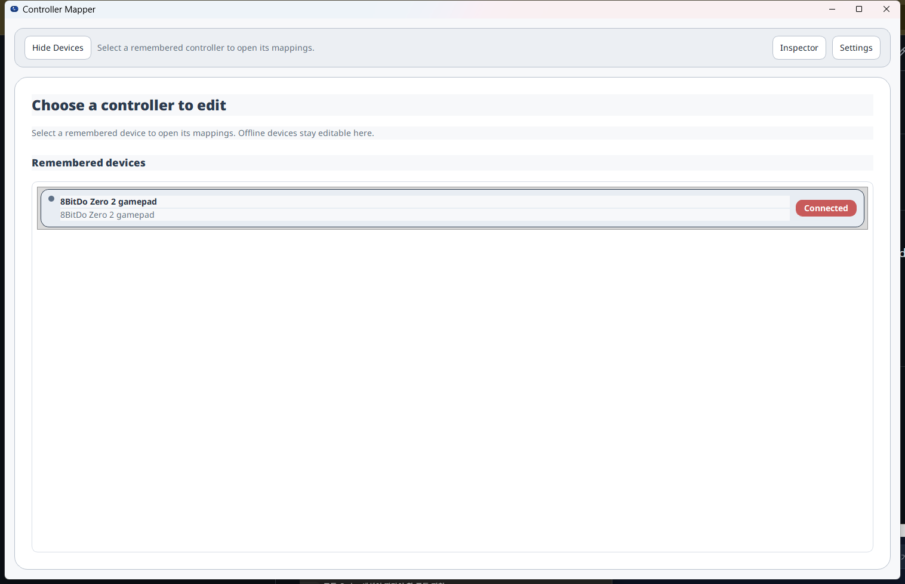
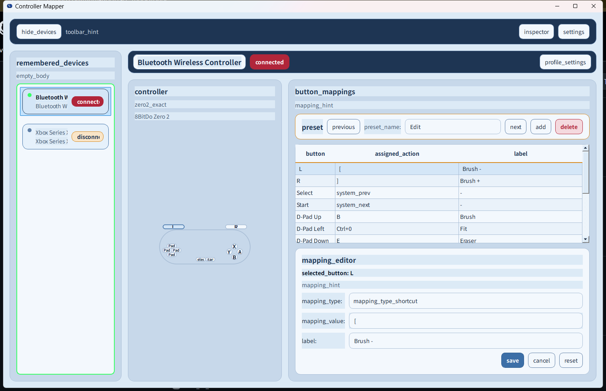
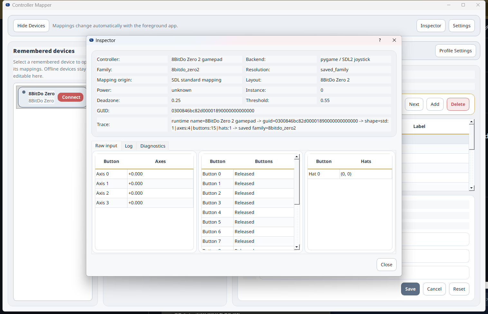
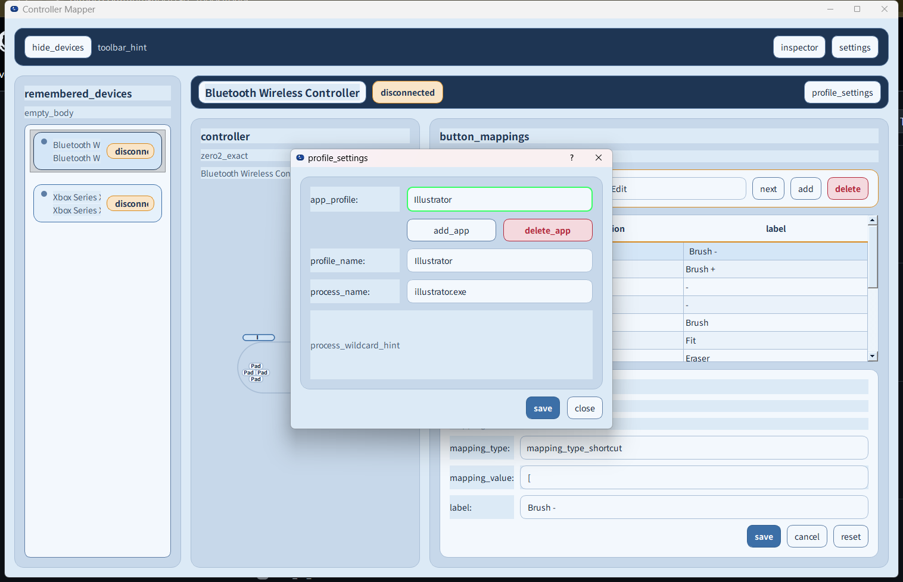

# BBCC

> 창작 단축키, 데스크톱 탐색, 미디어 제어를 위한 Windows-first 컨트롤러 매핑 도구.

[Overview](../../README.md) | [English](README.en.md) | [한국어](README.ko.md) | [中文](README.zh-CN.md) | [日本語](README.ja.md)

BBCC는 creative workflow, desktop navigation, media control을 위해 만든 Windows-first tray-resident controller mapping tool입니다. 메인 창을 계속 띄우지 않아도 컨트롤러로 빠르게 단축키를 실행하고 싶은 사용자를 위한 도구입니다.

핵심 개념은 다음과 같습니다.

`Device -> App Profile -> Preset -> Button Mapping`

실제로는 컨트롤러를 기억하고, active app에 따라 동작을 바꾸며, profile마다 여러 preset을 보관하고, controller input을 keyboard shortcut이나 다른 action으로 매핑합니다.

### Key Features

- foreground process name 기반 app profile switching.
- workflow별 per-profile preset 관리.
- 일반 media control을 위한 `YouTube` / media fallback profile.
- controller가 연결되지 않아도 remembered device를 편집할 수 있는 offline saved-device editing.
- multilingual UI support.
- theme support.
- controller-aware layout과 diagram.
- binding을 검토하고 조정하는 Inspector와 mapping editor.

### Supported Controllers

현재 실사용 기준 지원 범위는 다음 controller에 맞춰져 있습니다.

- 8BitDo Zero 2
- Xbox Controller / XInput-family devices

다른 controller model 지원이 필요하면 issue를 열고 device name과 발생한 일, 기대한 동작을 설명해 주세요.

### Typical Use Cases

- Photoshop, Illustrator 같은 creative app.
- 한 손 controller workflow.
- YouTube 및 기타 media control.
- Desktop navigation과 shortcut handling.

### Download / Release

Windows build와 release note는 [../download-release.md](../download-release.md)를 참고하세요. 안정 release와 prerelease asset을 구분해서 안내합니다.

### Basic Usage

repository를 clone하고 virtual environment를 만든 뒤 dependency를 설치하고 앱을 실행합니다.

```powershell
git clone <repository-url>
cd BBCC
py -3 -m venv .venv
.\.venv\Scripts\Activate.ps1
python -m pip install --upgrade pip
pip install -r requirements-dev.txt
python -m zero2_input_inspector
```

### Demo Walkthrough

demo flow는 연결된 `8BitDo Zero 2 gamepad`를 선택하고, mapping table을 검토하고, Inspector에서 raw input을 확인한 뒤 app-profile settings를 여는 흐름입니다.

1. `dist\BBCC.exe`를 실행합니다.
2. 첫 화면에서 controller가 `Connected`로 표시되는지 확인합니다.
3. connected device row를 클릭합니다.
4. `button_mappings` table에서 shortcut assignment와 label을 검토합니다.
5. button row를 선택해 `mapping_editor`에서 shortcut과 label을 수정합니다.
6. 오른쪽 위의 `Inspector`를 클릭해 axes, buttons, hats, backend, GUID 값을 확인합니다.
7. `Profile Settings`를 열어 fallback 및 process name 기반 app-specific profile을 관리합니다.

첫 화면은 controller가 감지되어 연결되었는지 보여 줍니다. remembered device row를 선택하면 mapping 화면으로 이동합니다.



mapping view는 active app profile, button binding, label, selected binding을 조정하는 editor panel을 보여 줍니다.



`Inspector` button은 axes, buttons, hats, backend information, device GUID detail을 포함한 live raw input 값을 엽니다.



`Profile Settings`에서는 fallback 및 app-specific profile을 이름과 process name으로 관리합니다.



### Notes

- BBCC는 Windows-first project입니다.
- Browser-based media fallback behavior는 더 넓은 media workflow의 일부입니다.
- Layout과 mapping은 계속 다듬는 중입니다.
- Controller coverage가 넓어지면서 일부 device handling은 계속 발전 중입니다.
- 실제 작업에서 global keyboard 또는 mouse mapping을 사용하기 전에 [Safety and Privacy](../safety-privacy.md)를 읽어 주세요.
- beta testing에는 [Support Runbook](../support-runbook.md)과 [Release Checklist](../release-checklist.md)를 사용하세요.

### Feedback / Contribution

Bug report와 pull request를 환영합니다. 다른 controller model 지원이 필요하면 issue에 device name, 실제 동작, 기대 동작을 함께 적어 주세요.
